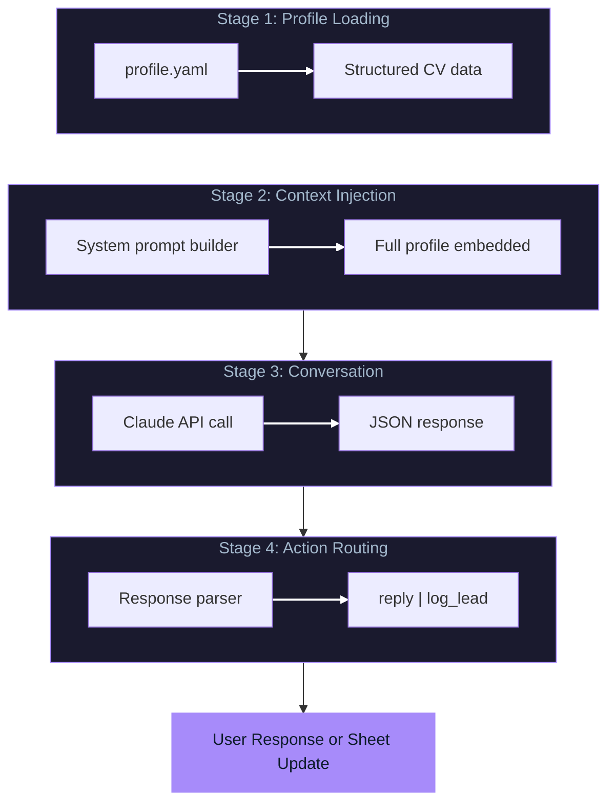
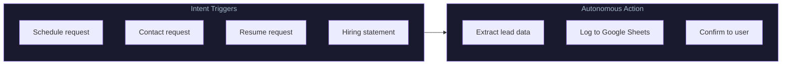
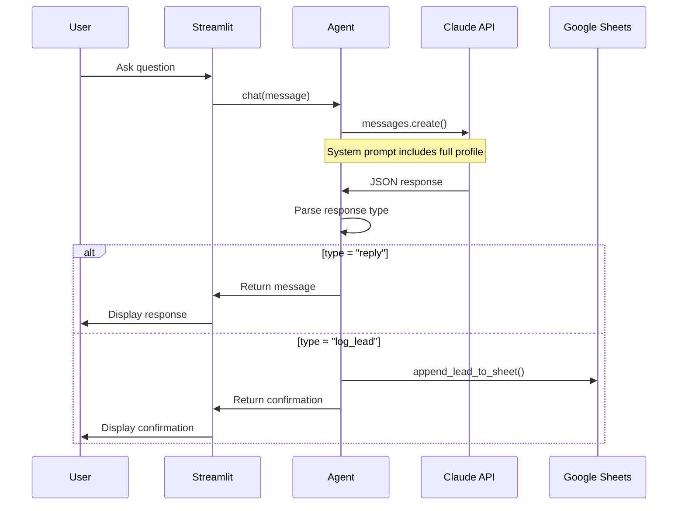

# Architecture

## System Overview

The Interactive AI Agent is a context-injection system that transforms a static professional profile into an interactive conversational agent with autonomous action capabilities.



---

## Why Context Injection (Not RAG)

| Approach | Use Case | Our Choice |
|----------|----------|------------|
| RAG | Large document corpus, dynamic updates | No |
| Context Injection | Small, static data (~10KB) | Yes |

**Rationale:** A professional CV is small enough to fit entirely in the system prompt. This eliminates retrieval latency, ensures 100% recall, and guarantees factual grounding since the model can only reference injected content.

---

## Response Contract

The agent returns structured JSON to enable deterministic action routing:

### Format 1: Conversational Reply

```json
{
  "type": "reply",
  "message": "I worked at Ernst & Young as an external consultant..."
}
```

### Format 2: Lead Logging Action

```json
{
  "type": "log_lead",
  "company": "Acme Corp",
  "contact_name": "Jane Smith",
  "contact_email": "jane@acme.com",
  "role_title": "ML Engineer",
  "notes": "Discussed RAG systems and GNN experience"
}
```

---

## Intent Detection

The agent autonomously triggers lead logging when it detects hiring intent:



**Trigger Examples:**
- "Can we schedule an interview?"
- "What's your email?"
- "Send me your resume"
- "We'd like to move forward"

---

## Module Responsibilities

| Module | Lines | Responsibility |
|--------|-------|----------------|
| `app.py` | ~150 | Streamlit web interface, session management |
| `agent.py` | ~100 | Core chat logic, Claude API integration, response routing |
| `prompts.py` | ~60 | System prompt template with JSON contract |
| `tools.py` | ~150 | Profile loading, email validation, Google Sheets API |
| `profile.yaml` | ~200 | Structured professional profile data |

---

## Data Flow



---

## Graceful Degradation

| Component | Missing | Fallback |
|-----------|---------|----------|
| Claude API | No `ANTHROPIC_API_KEY` | Error message, sidebar still works |
| Google Sheets | No `GOOGLE_SHEETS_ID` | Simulation mode (logs to console) |
| Service Account | No `credentials.json` | Simulation mode |

---

## Profile Schema

```yaml
profile:
  name: string
  headline: string
  location: string
  contact:
    email: string
    phone: string
    linkedin: string
    github: string
  summary: string
  education: list
  experience: list
  publications: list
  skills:
    ml_frameworks: list
    llm_platforms: list
    concepts: list
```

---

## Security Considerations

| Risk | Mitigation |
|------|------------|
| API Key Exposure | Environment variables, .gitignore |
| Profile Injection | YAML safe_load, no code execution |
| Lead Data Privacy | Optional Google Sheets, simulation fallback |
| Hallucination | Context-injection ensures factual grounding |
