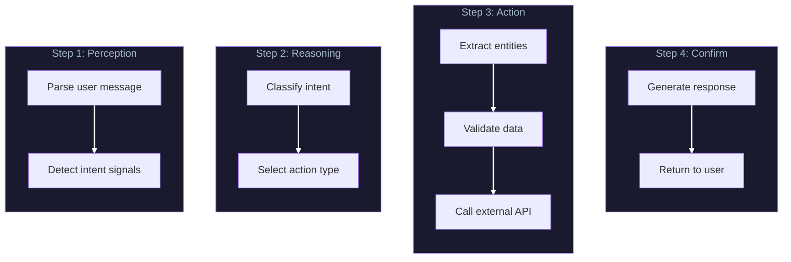
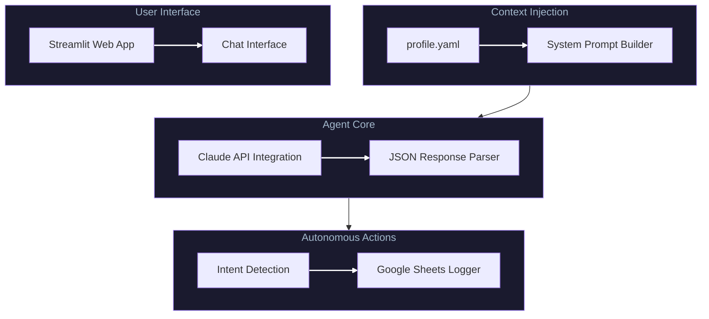

<div align="center">

**Chat with my CV!**

**Intelligent, Interactive AI Agent with Autonomous Lead Logging**

[-HuggingFace-FFD21E?style=for-the-badge&logo=huggingface&logoColor=0D1B2A)](https://huggingface.co/spaces/ges257/interactive-ai-agent)


[Architecture](ARCHITECTURE.md) · [Challenges](CHALLENGES.md) · [Learnings](LEARNINGS.md)

</div>

---

## Outcome

Built an autonomous LLM agent with tool-use capabilities for professional representation. Implemented structured output schema enforcing JSON response contracts, designed multi-step agentic workflow (intent classification, entity extraction, validation, external API action), and grounded all responses in YAML knowledge base to eliminate hallucination.

## Technical Build

Architected a context-injection approach where the full professional profile is embedded in the system prompt, ensuring 100% factual grounding with zero hallucination risk. Designed JSON response contract enabling deterministic routing between conversational replies and autonomous tool execution. Integrated Google Sheets API for real-time lead capture triggered by natural language intent detection.

---

## The Core Mechanism

```
User Question → Claude API → JSON Response → Action Router
                    ↓
            Profile Context
            (System Prompt)
```

| Response Type | Trigger | Action |
|---------------|---------|--------|
| `reply` | General questions | Return conversational response |
| `log_lead` | Hiring intent detected | Log to Google Sheets + confirm |

---

## Agentic Workflow

The autonomous multi-step task demonstrates agentic behavior:



**Intent Triggers:**
- "Can we schedule a call?"
- "What's your email?"
- "Send me your resume"
- "We'd like to interview you"

---

## Key AI Engineering Concepts

| Concept | Implementation |
|---------|----------------|
| **Agentic AI** | Autonomous agent with perception-action loop |
| **Tool Use** | External API calls (Google Sheets) triggered by LLM |
| **Structured Outputs** | JSON schema contract for deterministic behavior |
| **Knowledge Grounding** | YAML source-of-truth preventing hallucination |
| **Multi-Step Reasoning** | Intent, Extract, Validate, Act, Confirm |
| **Guardrails** | "Do not invent facts" instruction enforcement |

---

## Architecture



---

## Structured Output Contract

The agent returns structured JSON for deterministic action routing:

```python
# Normal reply - for answering questions
{"type": "reply", "message": "Your conversational response here"}

# Lead logging - when follow-up intent detected
{"type": "log_lead",
 "company": "company name or null",
 "contact_name": "their name or null",
 "contact_email": "their email or null",
 "role_title": "role discussed or null",
 "notes": "brief conversation summary"}
```

---

## Project Structure

```
interactive-ai-agent/
├── app/
│   ├── app.py              # Streamlit web interface (HF entry point)
│   ├── agent.py            # Core chat agent with Claude API
│   ├── prompts.py          # System prompt templates
│   ├── tools.py            # Profile loading, lead logging
│   ├── profile.yaml        # Professional profile data
│   └── requirements.txt    # App-specific dependencies
├── requirements.txt        # Full dependencies (local dev)
├── .gitignore
├── LICENSE
└── README.md
```

---

## Usage

```bash
# Install dependencies
pip install -r requirements.txt

# Set environment variables
export ANTHROPIC_API_KEY="your-api-key"
export GOOGLE_SHEETS_ID="your-sheet-id"  # Optional

# Run Streamlit app
streamlit run app/app.py
```

---

## Methods & Techniques

| Category | Methods |
|----------|---------|
| **Prompt Engineering** | Persona injection, role definition, constraint setting, output schema enforcement |
| **Structured Outputs** | Response contract, type discrimination, nullable fields, schema validation |
| **Intent Detection** | Keyword triggers, semantic understanding, context awareness |
| **Entity Extraction** | In-context extraction, structured output mapping, null handling |
| **Knowledge Grounding** | Single source of truth, prompt injection, negative instructions |

---

## Environment Variables

| Variable | Required | Description |
|----------|----------|-------------|
| `ANTHROPIC_API_KEY` | Yes | Claude API key |
| `GOOGLE_SHEETS_ID` | No | Sheet ID for lead logging |
| `GOOGLE_CREDENTIALS_FILE` | No | Path to service account JSON |

---

## License

MIT

---

<div align="center">

**Part of the AI/ML Portfolio**

[GitHub](https://github.com/ges257) | [LinkedIn](https://linkedin.com/in/gregory-e-schwartz)

</div>
